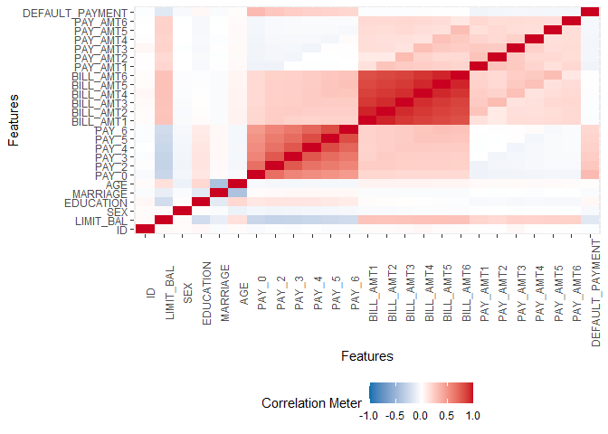
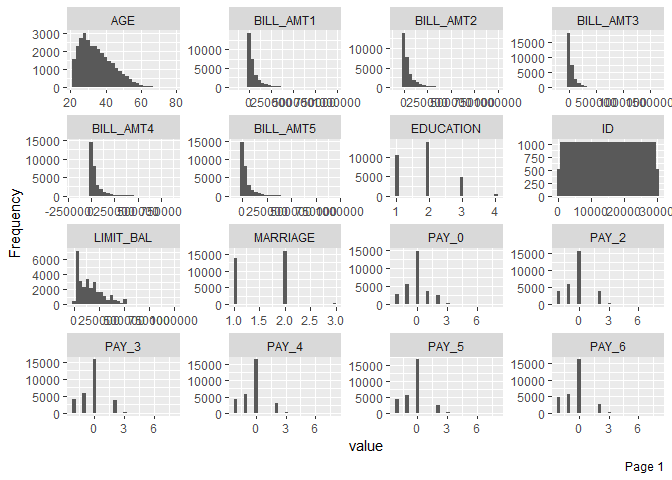
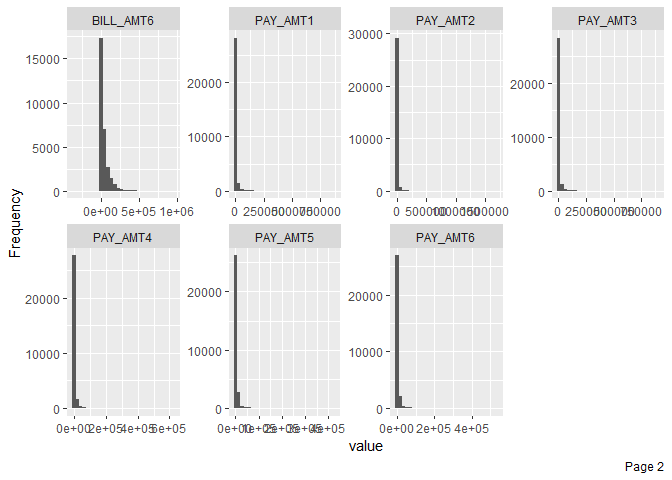
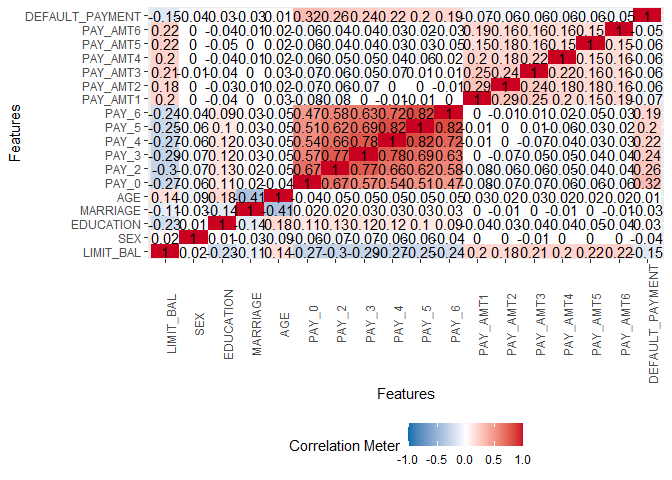
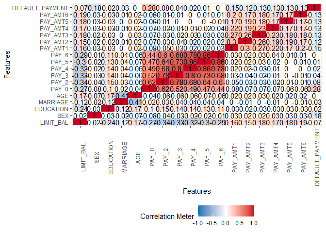

CIND820 - Big Data Analytics Project
================

<center>

<h1>

Initial Results and Code

</h1>

</center>

<center>

<h3>

Dmytro Volynskyy

</h2>

</center>

<center>

<h3>

Section D10. Student Number - 501009454

</h2>

</center>

-----

## GitHub Document

This is an R Markdown format used for publishing markdown documents to
GitHub. When you click the **Knit** button all R code chunks are run and
a markdown file (.md) suitable for publishing to GitHub is generated.

## Read dataset file in R

``` r
projectData = read.csv("D:\\Study\\CIND820 - Big Data Analytics Project\\Project\\Initial Analysis\\credit_card.csv", header = TRUE,  sep = ",", stringsAsFactors = FALSE)
```

## View the first six rows of the file

``` r
head(projectData)
```

    ##   ID LIMIT_BAL SEX EDUCATION MARRIAGE AGE PAY_0 PAY_2 PAY_3 PAY_4 PAY_5 PAY_6
    ## 1  1     20000   2         2        1  24     2     2    -1    -1    -2    -2
    ## 2  2    120000   2         2        2  26    -1     2     0     0     0     2
    ## 3  3     90000   2         2        2  34     0     0     0     0     0     0
    ## 4  4     50000   2         2        1  37     0     0     0     0     0     0
    ## 5  5     50000   1         2        1  57    -1     0    -1     0     0     0
    ## 6  6     50000   1         1        2  37     0     0     0     0     0     0
    ##   BILL_AMT1 BILL_AMT2 BILL_AMT3 BILL_AMT4 BILL_AMT5 BILL_AMT6 PAY_AMT1 PAY_AMT2
    ## 1      3913      3102       689         0         0         0        0      689
    ## 2      2682      1725      2682      3272      3455      3261        0     1000
    ## 3     29239     14027     13559     14331     14948     15549     1518     1500
    ## 4     46990     48233     49291     28314     28959     29547     2000     2019
    ## 5      8617      5670     35835     20940     19146     19131     2000    36681
    ## 6     64400     57069     57608     19394     19619     20024     2500     1815
    ##   PAY_AMT3 PAY_AMT4 PAY_AMT5 PAY_AMT6 default.payment.next.month
    ## 1        0        0        0        0                          1
    ## 2     1000     1000        0     2000                          1
    ## 3     1000     1000     1000     5000                          0
    ## 4     1200     1100     1069     1000                          0
    ## 5    10000     9000      689      679                          0
    ## 6      657     1000     1000      800                          0

## Rename class variable

``` r
colnames(projectData)[colnames(projectData)=="default.payment.next.month"] <- "DEFAULT_PAYMENT"
head(projectData)
```

    ##   ID LIMIT_BAL SEX EDUCATION MARRIAGE AGE PAY_0 PAY_2 PAY_3 PAY_4 PAY_5 PAY_6
    ## 1  1     20000   2         2        1  24     2     2    -1    -1    -2    -2
    ## 2  2    120000   2         2        2  26    -1     2     0     0     0     2
    ## 3  3     90000   2         2        2  34     0     0     0     0     0     0
    ## 4  4     50000   2         2        1  37     0     0     0     0     0     0
    ## 5  5     50000   1         2        1  57    -1     0    -1     0     0     0
    ## 6  6     50000   1         1        2  37     0     0     0     0     0     0
    ##   BILL_AMT1 BILL_AMT2 BILL_AMT3 BILL_AMT4 BILL_AMT5 BILL_AMT6 PAY_AMT1 PAY_AMT2
    ## 1      3913      3102       689         0         0         0        0      689
    ## 2      2682      1725      2682      3272      3455      3261        0     1000
    ## 3     29239     14027     13559     14331     14948     15549     1518     1500
    ## 4     46990     48233     49291     28314     28959     29547     2000     2019
    ## 5      8617      5670     35835     20940     19146     19131     2000    36681
    ## 6     64400     57069     57608     19394     19619     20024     2500     1815
    ##   PAY_AMT3 PAY_AMT4 PAY_AMT5 PAY_AMT6 DEFAULT_PAYMENT
    ## 1        0        0        0        0               1
    ## 2     1000     1000        0     2000               1
    ## 3     1000     1000     1000     5000               0
    ## 4     1200     1100     1069     1000               0
    ## 5    10000     9000      689      679               0
    ## 6      657     1000     1000      800               0

## Check the structure of the dataframe

``` r
dim(projectData)
```

    ## [1] 30000    25

``` r
str(projectData)
```

    ## 'data.frame':    30000 obs. of  25 variables:
    ##  $ ID             : int  1 2 3 4 5 6 7 8 9 10 ...
    ##  $ LIMIT_BAL      : num  20000 120000 90000 50000 50000 50000 500000 100000 140000 20000 ...
    ##  $ SEX            : int  2 2 2 2 1 1 1 2 2 1 ...
    ##  $ EDUCATION      : int  2 2 2 2 2 1 1 2 3 3 ...
    ##  $ MARRIAGE       : int  1 2 2 1 1 2 2 2 1 2 ...
    ##  $ AGE            : int  24 26 34 37 57 37 29 23 28 35 ...
    ##  $ PAY_0          : int  2 -1 0 0 -1 0 0 0 0 -2 ...
    ##  $ PAY_2          : int  2 2 0 0 0 0 0 -1 0 -2 ...
    ##  $ PAY_3          : int  -1 0 0 0 -1 0 0 -1 2 -2 ...
    ##  $ PAY_4          : int  -1 0 0 0 0 0 0 0 0 -2 ...
    ##  $ PAY_5          : int  -2 0 0 0 0 0 0 0 0 -1 ...
    ##  $ PAY_6          : int  -2 2 0 0 0 0 0 -1 0 -1 ...
    ##  $ BILL_AMT1      : num  3913 2682 29239 46990 8617 ...
    ##  $ BILL_AMT2      : num  3102 1725 14027 48233 5670 ...
    ##  $ BILL_AMT3      : num  689 2682 13559 49291 35835 ...
    ##  $ BILL_AMT4      : num  0 3272 14331 28314 20940 ...
    ##  $ BILL_AMT5      : num  0 3455 14948 28959 19146 ...
    ##  $ BILL_AMT6      : num  0 3261 15549 29547 19131 ...
    ##  $ PAY_AMT1       : num  0 0 1518 2000 2000 ...
    ##  $ PAY_AMT2       : num  689 1000 1500 2019 36681 ...
    ##  $ PAY_AMT3       : num  0 1000 1000 1200 10000 657 38000 0 432 0 ...
    ##  $ PAY_AMT4       : num  0 1000 1000 1100 9000 ...
    ##  $ PAY_AMT5       : num  0 0 1000 1069 689 ...
    ##  $ PAY_AMT6       : num  0 2000 5000 1000 679 ...
    ##  $ DEFAULT_PAYMENT: int  1 1 0 0 0 0 0 0 0 0 ...

## Install CRAN package ‘mlbench’ and activate it

``` r
#install.packages("mlbench")
library(mlbench)
```

    ## Warning: package 'mlbench' was built under R version 4.0.3

## Find distribution of class variable

``` r
y <- projectData$DEFAULT_PAYMENT
cbind(freq=table(y), percentage=prop.table(table(y))*100)
```

    ##    freq percentage
    ## 0 23364      77.88
    ## 1  6636      22.12

## Viewing the summary of dataset

``` r
summary(projectData)
```

    ##        ID          LIMIT_BAL            SEX          EDUCATION    
    ##  Min.   :    1   Min.   :  10000   Min.   :1.000   Min.   :0.000  
    ##  1st Qu.: 7501   1st Qu.:  50000   1st Qu.:1.000   1st Qu.:1.000  
    ##  Median :15000   Median : 140000   Median :2.000   Median :2.000  
    ##  Mean   :15000   Mean   : 167484   Mean   :1.604   Mean   :1.853  
    ##  3rd Qu.:22500   3rd Qu.: 240000   3rd Qu.:2.000   3rd Qu.:2.000  
    ##  Max.   :30000   Max.   :1000000   Max.   :2.000   Max.   :6.000  
    ##     MARRIAGE          AGE            PAY_0             PAY_2        
    ##  Min.   :0.000   Min.   :21.00   Min.   :-2.0000   Min.   :-2.0000  
    ##  1st Qu.:1.000   1st Qu.:28.00   1st Qu.:-1.0000   1st Qu.:-1.0000  
    ##  Median :2.000   Median :34.00   Median : 0.0000   Median : 0.0000  
    ##  Mean   :1.552   Mean   :35.49   Mean   :-0.0167   Mean   :-0.1338  
    ##  3rd Qu.:2.000   3rd Qu.:41.00   3rd Qu.: 0.0000   3rd Qu.: 0.0000  
    ##  Max.   :3.000   Max.   :79.00   Max.   : 8.0000   Max.   : 8.0000  
    ##      PAY_3             PAY_4             PAY_5             PAY_6        
    ##  Min.   :-2.0000   Min.   :-2.0000   Min.   :-2.0000   Min.   :-2.0000  
    ##  1st Qu.:-1.0000   1st Qu.:-1.0000   1st Qu.:-1.0000   1st Qu.:-1.0000  
    ##  Median : 0.0000   Median : 0.0000   Median : 0.0000   Median : 0.0000  
    ##  Mean   :-0.1662   Mean   :-0.2207   Mean   :-0.2662   Mean   :-0.2911  
    ##  3rd Qu.: 0.0000   3rd Qu.: 0.0000   3rd Qu.: 0.0000   3rd Qu.: 0.0000  
    ##  Max.   : 8.0000   Max.   : 8.0000   Max.   : 8.0000   Max.   : 8.0000  
    ##    BILL_AMT1         BILL_AMT2        BILL_AMT3         BILL_AMT4      
    ##  Min.   :-165580   Min.   :-69777   Min.   :-157264   Min.   :-170000  
    ##  1st Qu.:   3559   1st Qu.:  2985   1st Qu.:   2666   1st Qu.:   2327  
    ##  Median :  22382   Median : 21200   Median :  20089   Median :  19052  
    ##  Mean   :  51223   Mean   : 49179   Mean   :  47013   Mean   :  43263  
    ##  3rd Qu.:  67091   3rd Qu.: 64006   3rd Qu.:  60165   3rd Qu.:  54506  
    ##  Max.   : 964511   Max.   :983931   Max.   :1664089   Max.   : 891586  
    ##    BILL_AMT5        BILL_AMT6          PAY_AMT1         PAY_AMT2      
    ##  Min.   :-81334   Min.   :-339603   Min.   :     0   Min.   :      0  
    ##  1st Qu.:  1763   1st Qu.:   1256   1st Qu.:  1000   1st Qu.:    833  
    ##  Median : 18105   Median :  17071   Median :  2100   Median :   2009  
    ##  Mean   : 40311   Mean   :  38872   Mean   :  5664   Mean   :   5921  
    ##  3rd Qu.: 50191   3rd Qu.:  49198   3rd Qu.:  5006   3rd Qu.:   5000  
    ##  Max.   :927171   Max.   : 961664   Max.   :873552   Max.   :1684259  
    ##     PAY_AMT3         PAY_AMT4         PAY_AMT5           PAY_AMT6       
    ##  Min.   :     0   Min.   :     0   Min.   :     0.0   Min.   :     0.0  
    ##  1st Qu.:   390   1st Qu.:   296   1st Qu.:   252.5   1st Qu.:   117.8  
    ##  Median :  1800   Median :  1500   Median :  1500.0   Median :  1500.0  
    ##  Mean   :  5226   Mean   :  4826   Mean   :  4799.4   Mean   :  5215.5  
    ##  3rd Qu.:  4505   3rd Qu.:  4013   3rd Qu.:  4031.5   3rd Qu.:  4000.0  
    ##  Max.   :896040   Max.   :621000   Max.   :426529.0   Max.   :528666.0  
    ##  DEFAULT_PAYMENT 
    ##  Min.   :0.0000  
    ##  1st Qu.:0.0000  
    ##  Median :0.0000  
    ##  Mean   :0.2212  
    ##  3rd Qu.:0.0000  
    ##  Max.   :1.0000

## Activating libraries of ‘DataExplorer’ and ‘dplyr’ packages

``` r
library(DataExplorer)
```

    ## Warning: package 'DataExplorer' was built under R version 4.0.3

``` r
library(dplyr)
```

    ## 
    ## Attaching package: 'dplyr'

    ## The following objects are masked from 'package:stats':
    ## 
    ##     filter, lag

    ## The following objects are masked from 'package:base':
    ## 
    ##     intersect, setdiff, setequal, union

## Find distribution of Education and Mariage variables with not described categories in data description. Assigning those to meaningful ones

``` r
projectData %>% count(EDUCATION, sort = FALSE)
```

    ##   EDUCATION     n
    ## 1         0    14
    ## 2         1 10585
    ## 3         2 14030
    ## 4         3  4917
    ## 5         4   123
    ## 6         5   280
    ## 7         6    51

``` r
projectData %>% count(MARRIAGE, sort = FALSE)
```

    ##   MARRIAGE     n
    ## 1        0    54
    ## 2        1 13659
    ## 3        2 15964
    ## 4        3   323

``` r
projectData$EDUCATION[projectData$EDUCATION == 0] <- 4
projectData$EDUCATION[projectData$EDUCATION == 5] <- 4
projectData$EDUCATION[projectData$EDUCATION == 6] <- 4

projectData$MARRIAGE[projectData$MARRIAGE == 0] <- 3

projectData %>% count(EDUCATION, sort = FALSE)
```

    ##   EDUCATION     n
    ## 1         1 10585
    ## 2         2 14030
    ## 3         3  4917
    ## 4         4   468

``` r
projectData %>% count(MARRIAGE, sort = FALSE)
```

    ##   MARRIAGE     n
    ## 1        1 13659
    ## 2        2 15964
    ## 3        3   377

## Findig correlaction between dataset variables and printing a heat map of those

    ##                   LIMIT_BAL           SEX    EDUCATION     MARRIAGE         AGE
    ## LIMIT_BAL        1.00000000  0.0247552351 -0.231087535 -0.111012193  0.14471280
    ## SEX              0.02475524  1.0000000000  0.013627120 -0.028521804 -0.09087365
    ## EDUCATION       -0.23108754  0.0136271197  1.000000000 -0.136796941  0.18243430
    ## MARRIAGE        -0.11101219 -0.0285218038 -0.136796941  1.000000000 -0.41200144
    ## AGE              0.14471280 -0.0908736465  0.182434297 -0.412001437  1.00000000
    ## PAY_0           -0.27121433 -0.0576428789  0.112592779  0.018556670 -0.03944738
    ## PAY_2           -0.29638210 -0.0707710032  0.129703364  0.023620250 -0.05014778
    ## PAY_3           -0.28612295 -0.0660960564  0.122425201  0.032398549 -0.05304844
    ## PAY_4           -0.26746001 -0.0601732384  0.116530581  0.031831258 -0.04972167
    ## PAY_5           -0.24941139 -0.0550638850  0.104088344  0.034377176 -0.05382598
    ## PAY_6           -0.23519540 -0.0440077882  0.088986192  0.033167707 -0.04877343
    ## BILL_AMT1        0.28542986 -0.0336418696  0.016597237 -0.027832486  0.05623853
    ## BILL_AMT2        0.27831436 -0.0311834722  0.011979938 -0.025294286  0.05428307
    ## BILL_AMT3        0.28323578 -0.0245633117  0.006713832 -0.029082220  0.05370971
    ## BILL_AMT4        0.29398762 -0.0218796791 -0.006130773 -0.027274078  0.05135309
    ## BILL_AMT5        0.29556234 -0.0170051802 -0.012438556 -0.029269557  0.04934505
    ## BILL_AMT6        0.29038895 -0.0167331263 -0.012646400 -0.025065589  0.04761268
    ## PAY_AMT1         0.19523592 -0.0002424546 -0.041088050 -0.004652635  0.02614668
    ## PAY_AMT2         0.17840795 -0.0013909097 -0.032793022 -0.009512564  0.02178489
    ## PAY_AMT3         0.21016675 -0.0085966249 -0.044293209 -0.004249736  0.02924735
    ## PAY_AMT4         0.20324241 -0.0022289715 -0.040949062 -0.013969985  0.02137901
    ## PAY_AMT5         0.21720243 -0.0016671618 -0.045138449 -0.003019324  0.02284997
    ## PAY_AMT6         0.21959537 -0.0027660223 -0.044061042 -0.008382574  0.01947815
    ## DEFAULT_PAYMENT -0.15351988 -0.0399605777  0.033842230 -0.027574706  0.01388983
    ##                       PAY_0       PAY_2        PAY_3        PAY_4        PAY_5
    ## LIMIT_BAL       -0.27121433 -0.29638210 -0.286122954 -0.267460010 -0.249411395
    ## SEX             -0.05764288 -0.07077100 -0.066096056 -0.060173238 -0.055063885
    ## EDUCATION        0.11259278  0.12970336  0.122425201  0.116530581  0.104088344
    ## MARRIAGE         0.01855667  0.02362025  0.032398549  0.031831258  0.034377176
    ## AGE             -0.03944738 -0.05014778 -0.053048437 -0.049721674 -0.053825976
    ## PAY_0            1.00000000  0.67216438  0.574245093  0.538840627  0.509426064
    ## PAY_2            0.67216438  1.00000000  0.766551683  0.662067131  0.622780245
    ## PAY_3            0.57424509  0.76655168  1.000000000  0.777358873  0.686774511
    ## PAY_4            0.53884063  0.66206713  0.777358873  1.000000000  0.819835311
    ## PAY_5            0.50942606  0.62278025  0.686774511  0.819835311  1.000000000
    ## PAY_6            0.47455309  0.57550086  0.632683593  0.716449482  0.816900160
    ## BILL_AMT1        0.18706843  0.23488653  0.208472889  0.202812069  0.206683964
    ## BILL_AMT2        0.18985911  0.23525694  0.237294534  0.225816316  0.226913267
    ## BILL_AMT3        0.17978528  0.22414586  0.227494327  0.244983138  0.243334681
    ## BILL_AMT4        0.17912477  0.22223651  0.227202281  0.245917204  0.271915007
    ## BILL_AMT5        0.18063463  0.22134837  0.225145193  0.242902058  0.269783090
    ## BILL_AMT6        0.17698030  0.21940335  0.222326737  0.239154130  0.262509252
    ## PAY_AMT1        -0.07926871 -0.08070071  0.001294814 -0.009362136 -0.006088757
    ## PAY_AMT2        -0.07010052 -0.05899000 -0.066793396 -0.001943657 -0.003191332
    ## PAY_AMT3        -0.07056084 -0.05590123 -0.053310780 -0.069235204  0.009062363
    ## PAY_AMT4        -0.06400489 -0.04685841 -0.046066534 -0.043461430 -0.058298865
    ## PAY_AMT5        -0.05818989 -0.03709308 -0.035863071 -0.033589535 -0.033336504
    ## PAY_AMT6        -0.05867321 -0.03650038 -0.035861084 -0.026565088 -0.023027451
    ## DEFAULT_PAYMENT  0.32479373  0.26355120  0.235252514  0.216613637  0.204148914
    ##                        PAY_6   BILL_AMT1   BILL_AMT2    BILL_AMT3    BILL_AMT4
    ## LIMIT_BAL       -0.235195399  0.28542986  0.27831436  0.283235784  0.293987624
    ## SEX             -0.044007788 -0.03364187 -0.03118347 -0.024563312 -0.021879679
    ## EDUCATION        0.088986192  0.01659724  0.01197994  0.006713832 -0.006130773
    ## MARRIAGE         0.033167707 -0.02783249 -0.02529429 -0.029082220 -0.027274078
    ## AGE             -0.048773426  0.05623853  0.05428307  0.053709705  0.051353093
    ## PAY_0            0.474553086  0.18706843  0.18985911  0.179785282  0.179124771
    ## PAY_2            0.575500862  0.23488653  0.23525694  0.224145855  0.222236512
    ## PAY_3            0.632683593  0.20847289  0.23729453  0.227494327  0.227202281
    ## PAY_4            0.716449482  0.20281207  0.22581632  0.244983138  0.245917204
    ## PAY_5            0.816900160  0.20668396  0.22691327  0.243334681  0.271915007
    ## PAY_6            1.000000000  0.20737313  0.22692443  0.241181146  0.266356069
    ## BILL_AMT1        0.207373131  1.00000000  0.95148367  0.892278529  0.860272189
    ## BILL_AMT2        0.226924431  0.95148367  1.00000000  0.928326259  0.892482291
    ## BILL_AMT3        0.241181146  0.89227853  0.92832626  1.000000000  0.923969457
    ## BILL_AMT4        0.266356069  0.86027219  0.89248229  0.923969457  1.000000000
    ## BILL_AMT5        0.290893745  0.82977861  0.85977831  0.883909697  0.940134404
    ## BILL_AMT6        0.285090991  0.80265019  0.83159356  0.853320091  0.900940955
    ## PAY_AMT1        -0.001496289  0.14027728  0.28036536  0.244335238  0.233011852
    ## PAY_AMT2        -0.005223268  0.09935503  0.10085088  0.316935977  0.207563729
    ## PAY_AMT3         0.005833774  0.15688714  0.15071819  0.130011182  0.300022529
    ## PAY_AMT4         0.019017863  0.15830253  0.14739810  0.143404605  0.130191408
    ## PAY_AMT5        -0.046433641  0.16702571  0.15795741  0.179712350  0.160433038
    ## PAY_AMT6        -0.025299338  0.17934112  0.17425617  0.182325966  0.177636994
    ## DEFAULT_PAYMENT  0.186866362 -0.01964420 -0.01419322 -0.014075518 -0.010156496
    ##                    BILL_AMT5    BILL_AMT6      PAY_AMT1     PAY_AMT2
    ## LIMIT_BAL        0.295562338  0.290388951  0.1952359152  0.178407954
    ## SEX             -0.017005180 -0.016733126 -0.0002424546 -0.001390910
    ## EDUCATION       -0.012438556 -0.012646400 -0.0410880499 -0.032793022
    ## MARRIAGE        -0.029269557 -0.025065589 -0.0046526355 -0.009512564
    ## AGE              0.049345048  0.047612678  0.0261466791  0.021784893
    ## PAY_0            0.180634625  0.176980296 -0.0792687112 -0.070100521
    ## PAY_2            0.221348373  0.219403351 -0.0807007098 -0.058989999
    ## PAY_3            0.225145193  0.222326737  0.0012948143 -0.066793396
    ## PAY_4            0.242902058  0.239154130 -0.0093621358 -0.001943657
    ## PAY_5            0.269783090  0.262509252 -0.0060887571 -0.003191332
    ## PAY_6            0.290893745  0.285090991 -0.0014962890 -0.005223268
    ## BILL_AMT1        0.829778606  0.802650189  0.1402772776  0.099355035
    ## BILL_AMT2        0.859778307  0.831593559  0.2803653570  0.100850878
    ## BILL_AMT3        0.883909697  0.853320091  0.2443352376  0.316935977
    ## BILL_AMT4        0.940134404  0.900940955  0.2330118522  0.207563729
    ## BILL_AMT5        1.000000000  0.946196807  0.2170308238  0.181246491
    ## BILL_AMT6        0.946196807  1.000000000  0.1999650062  0.172662937
    ## PAY_AMT1         0.217030824  0.199965006  1.0000000000  0.285575529
    ## PAY_AMT2         0.181246491  0.172662937  0.2855755287  1.000000000
    ## PAY_AMT3         0.252304862  0.233769793  0.2521911390  0.244770450
    ## PAY_AMT4         0.293118463  0.250236825  0.1995579312  0.180106744
    ## PAY_AMT5         0.141574180  0.307728890  0.1484592750  0.180907753
    ## PAY_AMT6         0.164184450  0.115494167  0.1857352554  0.157633916
    ## DEFAULT_PAYMENT -0.006760464 -0.005372315 -0.0729294878 -0.058578707
    ##                     PAY_AMT3     PAY_AMT4     PAY_AMT5     PAY_AMT6
    ## LIMIT_BAL        0.210166748  0.203242410  0.217202432  0.219595369
    ## SEX             -0.008596625 -0.002228972 -0.001667162 -0.002766022
    ## EDUCATION       -0.044293209 -0.040949062 -0.045138449 -0.044061042
    ## MARRIAGE        -0.004249736 -0.013969985 -0.003019324 -0.008382574
    ## AGE              0.029247353  0.021379006  0.022849974  0.019478153
    ## PAY_0           -0.070560838 -0.064004889 -0.058189886 -0.058673214
    ## PAY_2           -0.055901231 -0.046858412 -0.037093080 -0.036500376
    ## PAY_3           -0.053310780 -0.046066534 -0.035863071 -0.035861084
    ## PAY_4           -0.069235204 -0.043461430 -0.033589535 -0.026565088
    ## PAY_5            0.009062363 -0.058298865 -0.033336504 -0.023027451
    ## PAY_6            0.005833774  0.019017863 -0.046433641 -0.025299338
    ## BILL_AMT1        0.156887138  0.158302533  0.167025712  0.179341122
    ## BILL_AMT2        0.150718194  0.147398104  0.157957412  0.174256166
    ## BILL_AMT3        0.130011182  0.143404605  0.179712350  0.182325966
    ## BILL_AMT4        0.300022529  0.130191408  0.160433038  0.177636994
    ## BILL_AMT5        0.252304862  0.293118463  0.141574180  0.164184450
    ## BILL_AMT6        0.233769793  0.250236825  0.307728890  0.115494167
    ## PAY_AMT1         0.252191139  0.199557931  0.148459275  0.185735255
    ## PAY_AMT2         0.244770450  0.180106744  0.180907753  0.157633916
    ## PAY_AMT3         1.000000000  0.216325092  0.159213720  0.162740033
    ## PAY_AMT4         0.216325092  1.000000000  0.151830436  0.157833916
    ## PAY_AMT5         0.159213720  0.151830436  1.000000000  0.154895525
    ## PAY_AMT6         0.162740033  0.157833916  0.154895525  1.000000000
    ## DEFAULT_PAYMENT -0.056250351 -0.056827401 -0.055123516 -0.053183340
    ##                 DEFAULT_PAYMENT
    ## LIMIT_BAL          -0.153519876
    ## SEX                -0.039960578
    ## EDUCATION           0.033842230
    ## MARRIAGE           -0.027574706
    ## AGE                 0.013889834
    ## PAY_0               0.324793728
    ## PAY_2               0.263551202
    ## PAY_3               0.235252514
    ## PAY_4               0.216613637
    ## PAY_5               0.204148914
    ## PAY_6               0.186866362
    ## BILL_AMT1          -0.019644197
    ## BILL_AMT2          -0.014193218
    ## BILL_AMT3          -0.014075518
    ## BILL_AMT4          -0.010156496
    ## BILL_AMT5          -0.006760464
    ## BILL_AMT6          -0.005372315
    ## PAY_AMT1           -0.072929488
    ## PAY_AMT2           -0.058578707
    ## PAY_AMT3           -0.056250351
    ## PAY_AMT4           -0.056827401
    ## PAY_AMT5           -0.055123516
    ## PAY_AMT6           -0.053183340
    ## DEFAULT_PAYMENT     1.000000000

<!-- -->

## Printing histograms of each attribute for univariate analysis

<!-- --><!-- -->

## Removing not needed ‘ID’ variable and the ones which have very weak correlation with a class variable

``` r
modelData <- select(projectData, !c('ID', 'BILL_AMT1','BILL_AMT2', 'BILL_AMT3','BILL_AMT4','BILL_AMT5','BILL_AMT6'))
```

## Plot a new heat map of correlations after removing attributes from the dataset

<!-- -->

## Installing and activating a CRAN package ‘imbalance’

``` r
#install.packages('imbalance')
library(imbalance)
```

    ## Warning: package 'imbalance' was built under R version 4.0.3

## Oversampling of the dataset with new instances of class variable ‘1’ using MWMOTE technique

``` r
newSamples <- mwmote(modelData, numInstances = 10000, classAttr = "DEFAULT_PAYMENT")
summary(newSamples)
```

    ##    LIMIT_BAL           SEX          EDUCATION        MARRIAGE    
    ##  Min.   : 10000   Min.   :1.000   Min.   :1.000   Min.   :1.000  
    ##  1st Qu.: 79073   1st Qu.:1.000   1st Qu.:1.148   1st Qu.:1.057  
    ##  Median :157398   Median :1.000   Median :1.754   Median :1.578  
    ##  Mean   :179435   Mean   :1.347   Mean   :1.741   Mean   :1.544  
    ##  3rd Qu.:266495   3rd Qu.:2.000   3rd Qu.:2.000   3rd Qu.:2.000  
    ##  Max.   :500000   Max.   :2.000   Max.   :3.953   Max.   :3.000  
    ##       AGE            PAY_0             PAY_2             PAY_3        
    ##  Min.   :21.00   Min.   :-2.0000   Min.   :-2.0000   Min.   :-2.0000  
    ##  1st Qu.:30.00   1st Qu.: 0.0000   1st Qu.:-1.0000   1st Qu.:-1.0000  
    ##  Median :35.00   Median : 0.0000   Median :-1.0000   Median :-1.0000  
    ##  Mean   :35.35   Mean   : 0.1986   Mean   :-0.4825   Mean   :-0.6184  
    ##  3rd Qu.:40.00   3rd Qu.: 1.0000   3rd Qu.: 0.0000   3rd Qu.: 0.0000  
    ##  Max.   :74.00   Max.   : 7.0000   Max.   : 6.0000   Max.   : 7.0000  
    ##      PAY_4             PAY_5             PAY_6            PAY_AMT1      
    ##  Min.   :-2.0000   Min.   :-2.0000   Min.   :-2.0000   Min.   :    0.0  
    ##  1st Qu.:-2.0000   1st Qu.:-2.0000   1st Qu.:-2.0000   1st Qu.:    0.0  
    ##  Median :-1.0000   Median :-1.0000   Median :-1.0000   Median :  165.2  
    ##  Mean   :-0.6762   Mean   :-0.7285   Mean   :-0.7696   Mean   :  758.9  
    ##  3rd Qu.: 0.0000   3rd Qu.: 0.0000   3rd Qu.: 0.0000   3rd Qu.: 1000.6  
    ##  Max.   : 7.0000   Max.   : 7.0000   Max.   : 7.0000   Max.   :27057.9  
    ##     PAY_AMT2          PAY_AMT3           PAY_AMT4           PAY_AMT5       
    ##  Min.   :    0.0   Min.   :    0.00   Min.   :    0.00   Min.   :    0.00  
    ##  1st Qu.:    0.0   1st Qu.:    0.00   1st Qu.:    0.00   1st Qu.:    0.00  
    ##  Median :  105.7   Median :   58.06   Median :   53.55   Median :   52.68  
    ##  Mean   :  666.6   Mean   :  566.59   Mean   :  514.17   Mean   :  521.45  
    ##  3rd Qu.:  841.5   3rd Qu.:  637.08   3rd Qu.:  569.54   3rd Qu.:  575.99  
    ##  Max.   :29836.4   Max.   :83024.27   Max.   :26453.18   Max.   :20815.37  
    ##     PAY_AMT6        DEFAULT_PAYMENT
    ##  Min.   :    0.00   Min.   :1      
    ##  1st Qu.:    0.00   1st Qu.:1      
    ##  Median :   12.79   Median :1      
    ##  Mean   :  484.95   Mean   :1      
    ##  3rd Qu.:  509.28   3rd Qu.:1      
    ##  Max.   :31057.07   Max.   :1

## Merge newly created records with an original dataset

``` r
newData<-rbind(modelData, newSamples)
```

## Shuffle randomly all records in a merged dataset in order not to have variables of one class in each fold of k-fold cross validation

``` r
set.seed(7)
rows <- sample(nrow(newData))
newDataShuffled <- newData[rows, ]
```

## Plot again a correlation heat map

<!-- -->

## Find class variable distribution in a resulting dataset

``` r
z <- newData$DEFAULT_PAYMENT
cbind(freq=table(z), percentage=prop.table(table(z))*100)
```

    ##    freq percentage
    ## 0 23364      58.41
    ## 1 16636      41.59
